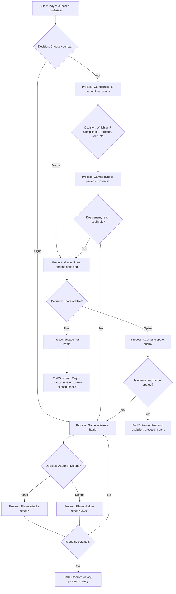

# capstone-session-5

```mermaid
flowchart TD
    A[Start: Player launches Undertale] --> B{Decision: Choose your path}
    B -->|Fight| C[Process: Game initiates a battle]
    B -->|Act| D[Process: Game presents interaction options]
    B -->|Mercy| E[Process: Game allows sparing or fleeing]
    C --> F{Decision: Attack or Defend?}
    F -->|Attack| G[Process: Player attacks enemy]
    F -->|Defend| H[Process: Player dodges enemy attack]
    G --> I{Is enemy defeated?}
    H --> I
    I -- Yes --> J[End/Outcome: Victory, proceed in story]
    I -- No --> C
    D --> K{Decision: Which act? Compliment, Threaten, Joke, etc.}
    K --> L[Process: Game reacts to player's chosen act]
    L --> M{Does enemy react positively?}
    M -- Yes --> E
    M -- No --> C
    E --> N{Decision: Spare or Flee?}
    N -- Spare --> O[Process: Attempt to spare enemy]
    N -- Flee --> P[Process: Escape from battle]
    O --> Q{Is enemy ready to be spared?}
    Q -- Yes --> R[End/Outcome: Peaceful resolution, proceed in story]
    Q -- No --> C
    P --> S[End/Outcome: Player escapes, may encounter consequences]
```
